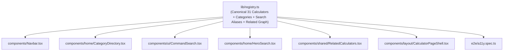

# FINCALC INDIA — UI/UX V2 Comprehensive Visual & Code Audit

Date: September 2026
Branch: `design/ui-ux-v2-product-cleanup`
Base: `a4597f949ce09a84c2b56eb8343597a85fdd47f8`
Lead: ANTIGRAVITY (Technical Architecture & Engine Protection) + LOVABLE (Visual & Interaction Design)

---

## 1. Executive Summary

FinCalc India provides 31 specialized Indian financial calculators across taxation, investments, debt, equity derivatives, and corporate finance. Following the initial redesign in PR #12, this UI/UX V2 pass systematically cleans technical debt, eliminates dead code and duplicate category configurations, unifies the visual design language around an authentic senior-fintech aesthetic, provides WCAG 2A/2AA accessible dialogs/drawers, and implements high-value product features (input reloading "Open Again", comparison scenarios, and local-first quick return).

The underlying financial engines (`lib/math.ts`), statutory assessment rules (`lib/constants/tax-year-2026-27.ts`), calculator contracts, and 568+ automated regression tests remain strictly frozen and protected.

---

## 2. Multi-Viewport Responsive Matrix

| Viewport Category | Screen Dimension | Target Devices | Audit Status & Key Findings |
| :--- | :--- | :--- | :--- |
| **Ultra-Wide / Desktop** | 1440 × 900 px | MacBook Pro 15", Desktop Monitors | Hero metric cards balanced; need max-width containment on charts; breadcrumbs clear. |
| **Standard Desktop** | 1280 × 800 px | MacBook Air 13", Standard Laptops | 2-column calculator layout (Inputs left, Results right) functions smoothly; sticky summary needs max-height constraint. |
| **Tablet Portrait** | 768 × 1024 px | iPad Mini, iPad Air | Single column stacking; summary jumps below inputs; needs sticky bottom bar or top hero result snapshot. |
| **Large Mobile** | 430 × 932 px | iPhone 14/15/16 Pro Max | High touch ergonomic fidelity required; slider thumb hitboxes must exceed 44×44px. |
| **Standard Mobile** | 390 × 844 px | iPhone 12/13/14/15, Pixel 7/8 | Primary mobile target; navigation drawer needs true modal trap; input font-size ≥ 16px to prevent iOS auto-zoom. |
| **Compact Mobile** | 375 × 812 px | iPhone X / XS / 11 Pro / SE3 | Horizontal table scroll overflow must be clearly signaled; segmented controls must not wrap awkwardly. |
| **Narrow Mobile** | 320 × 568 px | iPhone SE 1st Gen, Small Androids | Edge padding reduced to 12px; breakdown stat cards wrap into 1 column cleanly without clipping. |

---

## 3. Comprehensive Component & Feature Inventory

Categorized by: `KEEP`, `POLISH`, `BUG`, `DUPLICATE`, `DEAD/JUNK`, `ACCESSIBILITY`, `CONTENT`, `PERFORMANCE`, `FEATURE OPPORTUNITY`.

### 3.1 Global Navigation & Shell
- **`components/Navbar.tsx`**
  - `DUPLICATE`: Redefines categories and calculator lists locally rather than importing from a canonical registry.
  - `ACCESSIBILITY`: Desktop mega-menu relies on hover state without robust keyboard focus-within trap; mobile hamburger toggle lacks aria-expanded and modal trap.
  - `POLISH`: Refactor to use `CALCULATOR_REGISTRY` and render clean category badges with matching semantic icons.
- **`components/ui/CommandSearch.tsx`**
  - `ACCESSIBILITY`: Missing ARIA `role="dialog"`, `aria-modal="true"`, focus trap, and Escape key listener; missing `role="combobox"` / `role="listbox"` semantics.
  - `PERFORMANCE`: Uses client-side filter over locally duplicated array.
  - `POLISH`: Unify with `searchCalculators()` in `lib/registry.ts`, support alias keywords (e.g. "MF", "housing loan", "80C"), and provide ArrowUp/ArrowDown navigation.
- **`components/home/HeroSearch.tsx`**
  - `DUPLICATE`: Re-implements search dropdown logic with another copy of calculator metadata.
  - `POLISH`: Standardize search queries and keyboard event handling.

### 3.2 Dead Code & Junk Removal
- **`components/home/HomeHeroActions.tsx`**
  - `DEAD/JUNK`: Zero import references throughout the entire repository. Safe to delete.
- **`components/ui/CalculatorWorkspace.tsx`**
  - `DEAD/JUNK`: Unused component superseded by domain-specific calculator layouts. Safe to delete.
- **`package.json` (`@types/numeral`)**
  - `DEAD/JUNK`: Numeral library is not in dependencies; `@types/numeral` is an orphaned type package. Safe to remove.
- **`docs/` historical plans**
  - `DEAD/JUNK`: Move superseded design/audit docs into `docs/archive/` to keep root documentation focused.

### 3.3 Design Tokens & Styling
- **`styles/tokens.css` vs `tailwind.config.ts`**
  - `BUG`: Contradiction between `--primary: 29 78 216` (Deep Blue 700) in `tokens.css` and `primary.500: #10b981` (Emerald green) in `tailwind.config.ts`.
  - `POLISH`: Standardize primary palette on fintech blue (`#1d4ed8` / Blue 700), matching the institutional trust feel of Indian banking and investing applications.
- **Tailwind animation classes (`animate-in`, `zoom-in-95`, `fade-in`)**
  - `BUG`: `tailwindcss-animate` is not installed; these classes are silent no-ops.
  - `POLISH`: Either define CSS keyframes in `globals.css` / `tailwind.config.ts` or use standard CSS transition properties.

### 3.4 Core Input & Output Primitives
- **`components/ui/HybridInput.tsx`**
  - `BUG`: Premature clamping on draft input. When `min=500`, typing "1" immediately clamps to 500, blocking the user from drafting "1500".
  - `ACCESSIBILITY`: Input and label lack programmatic linkage via `id` and `htmlFor`; missing `aria-describedby` for error or helper messages.
  - `POLISH`: Keep quick Indian shorthand parsing (`25k`, `1.5L`, `1Cr`), decouple display string from committed numeric value on blur/enter, and support `hideSlider` for high-variance inputs.
- **`components/ui/ResultHero.tsx`**
  - `BUG`: Hardcoded tone badges forcing "Positive Gain" or "Net Loss / Expense" regardless of domain context (e.g. Income Tax or Home Loan EMI displaying "Positive Gain").
  - `POLISH`: Decouple visual tone from semantic status text. Only render proportional breakdown bars when sub-metrics strictly sum up to the total. Enable tabular numbers (`font-variant-numeric: tabular-nums`).

### 3.5 Tax & Compliance Suite
- **`components/calculators/tax/TaxCalculator.tsx`**
  - `CONTENT`: Uses decorative emojis ("⚡ New Regime", "Old Regime") on functional controls.
  - `DUPLICATE`: Redundant duplicate toggle buttons for advanced income streams.
  - `POLISH`: Reorganize into progressive 4-step disclosure: Profile -> Income Sources -> Deductions -> Comparative Slabs & Results.
- **`components/calculators/hra/HRACalculator.tsx` & `CapitalGainsCalculator.tsx`**
  - `POLISH`: High information density; clean statutory rule explanation callouts.

### 3.6 Wealth & Debt Suite (SIP, EMI, FD, PPF, Lumpsum)
- **`components/calculators/sip/SIPCalculator.tsx` & `EMICalculator.tsx`**
  - `FEATURE OPPORTUNITY`: Scenario comparison (Compare Scenario A vs B with tenure or interest adjustments).
  - `POLISH`: Refined summary cards, collapsible yearly amortization schedules, high visual contrast between invested principal and interest earned.

### 3.7 Trading & Valuation Suite (F&O, Option Payoff, DCF, WACC, DuPont)
- **`components/calculators/fno/FNOBrokerageCalculator.tsx` & `OptionPayoffCalculator.tsx`**
  - `POLISH`: Dense, terminal-inspired trading inputs; clear regulatory charge breakdown (STT, Exchange turnover, GST, SEBI charges, Stamp duty).
- **`components/calculators/dcf/DCFCalculator.tsx` & `WACCCalculator.tsx`**
  - `POLISH`: Analyst workstation styling with tabular cash flows, sensitivity tables, and cost of capital matrices.

### 3.8 Calculation History & Persistence
- **`components/history/HistoryClient.tsx`**
  - `FEATURE OPPORTUNITY`: "Open Again" feature allowing users to restore past calculation parameters directly into active calculators.
  - `BUG`: Uses native blocking `window.confirm()` for history clearing.
  - `ACCESSIBILITY`: Replace with non-blocking accessible confirmation dialog with keyboard trap.
  - `CONTENT`: Refine DPDP compliance claims to factual local storage privacy statements.

### 3.9 Automated Accessibility Audit
- **`e2e/a11y.spec.ts`**
  - `BUG`: Currently tests only 10 routes instead of all 31 registered calculator routes.
  - `POLISH`: Dynamically iterate over `CALCULATOR_REGISTRY` to audit 100% of routes with `@axe-core/playwright`.

---

## 4. Architectural Target State

---

## 5. Non-Regression Safeguards

1. Deterministic snapshots of calculation results across core engines before and after UI modifications.
2. Zero edits to `lib/math.ts` or tax schedule constants.
3. 568 automated unit, golden fixture, and statutory tests must pass continuously throughout each phase.
